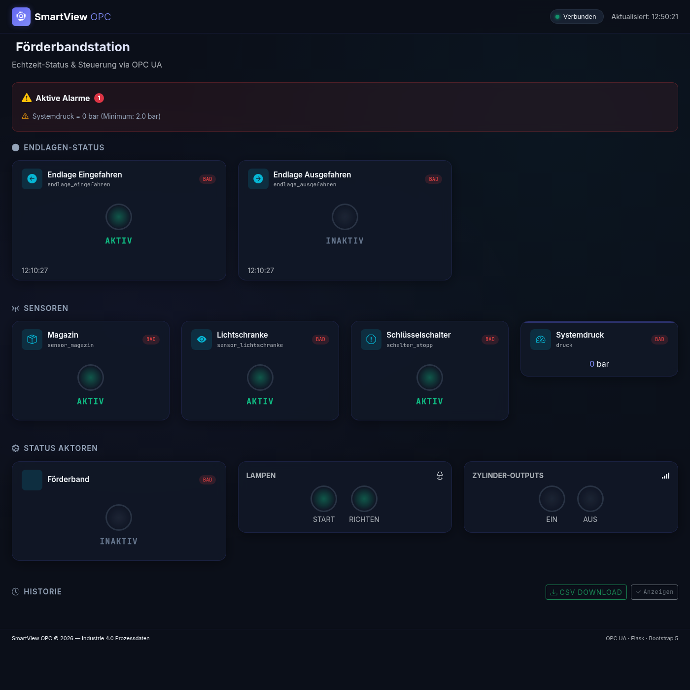
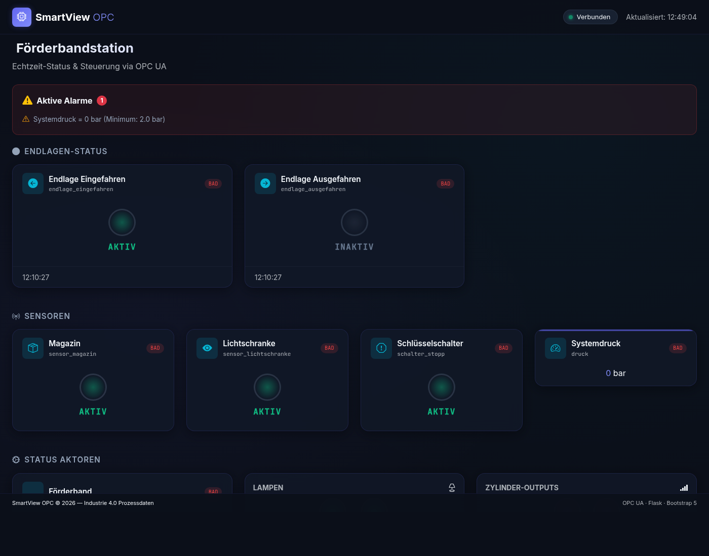

# SmartView OPC – Förderbandstation

> SCADA-System für Industrie 4.0 | Siemens S7-1500 via OPC UA | Raspberry Pi 4B Edge Device

---

## Projektbeschreibung

SmartView OPC ist ein leichtgewichtiges SCADA-System (Supervisory Control and Data Acquisition), das Prozessdaten von einer **Siemens S7-1500 SPS** (IP: `192.168.6.12`) über das **OPC UA Protokoll** (IEC 62541) ausliest und auf einem modernen, responsiven **Web-Dashboard** visualisiert.

Aktuell konfiguriert für die **Förderbandstation** mit Endlagen-Erkennung, Sensor- und Aktorstatus.

Das System läuft vollständig auf einem **Raspberry Pi 4B** als Edge Device – ohne Cloud-Abhängigkeit, ohne externe Server.

> **Hinweis:** Der Analogwert (Systemdruck via IO-Link) konnte aufgrund eines defekten IO-Link-Moduls nicht in Betrieb genommen werden. Mit dem Lehrer abgesprochen und freigegeben. Siehe [CHANGELOG.md](CHANGELOG.md).

---

## Architekturdiagramm

```
  Feldebene                Steuerung              Edge Device (RPi 4B)         Browser
 ┌──────────┐             ┌──────────────┐        ┌─────────────────────┐    ┌──────────┐
 │Endlagen- │──PROFINET──►│ Siemens      │OPC UA  │ opc_client.py       │    │          │
 │sensoren  │             │ S7-1500      │◄──────►│ app.py (Flask)      │HTTP│ Dashboard│
 │Förder-   │             │ 192.168.6.12 │        │ history.py (CSV)    │───►│ Bootstrap│
 │band      │             │ OPC UA :4840 │        │                     │    │ 5        │
 └──────────┘             └──────────────┘        │ Port :5000          │    └──────────┘
                                                  └─────────────────────┘
```

Detaillierte Architektur: [docs/SCADA.md](docs/SCADA.md)

---

## Schnellstart

```bash
# 1. Repository klonen
git clone https://github.com/Andre-Kuempflein/smartview-opc.git
cd smartview-opc

# 2. Python-Abhängigkeiten installieren
pip install -r backend/requirements.txt

# 3. Server starten
python backend/app.py

# 4. Browser öffnen
# http://localhost:5000
```

> **Hinweis:** Die OPC UA Verbindung ist bereits auf die Förderbandstation konfiguriert (`backend/config.py`).  
> Für Entwicklung ohne SPS: `DEMO_MODE=true` als Umgebungsvariable setzen.

### Mit Docker (empfohlen für Raspberry Pi)

```bash
# Container bauen und starten
docker compose up -d

# Browser öffnen
# http://<RaspberryPi-IP>:5000

# Logs anzeigen
docker compose logs -f
```

---

## Projektstruktur

```
smartview-opc/
├── backend/
│   ├── app.py            # Flask REST API (Einstiegspunkt)
│   ├── opc_client.py     # OPC UA Client: Polling, Reconnect, Schreibzugriff
│   ├── history.py        # CSV-Historisierung der Messwerte
│   ├── config.py         # Konfiguration: OPC UA Endpunkt, Tags, Ports
│   └── requirements.txt  # Python-Abhängigkeiten
│
├── frontend/
│   ├── index.html        # Dashboard-Hauptseite
│   ├── css/
│   │   └── style.css     # Industrielles Dark-Theme
│   └── js/
│       └── app.js        # Polling-Client + Live-Aktualisierung der Karten
│
├── docs/
│   └── SCADA.md          # Technische Dokumentation: SCADA, OPC UA, Architektur
│
├── data/                 # Wird automatisch erstellt: CSV-History
│
├── Dockerfile            # Container-Image Definition
├── docker-compose.yml    # Container-Deployment
├── CHANGELOG.md          # Versionshistorie
└── README.md             # Diese Datei
```

---

## Konfiguration

Die gesamte Konfiguration befindet sich in `backend/config.py`.

### Wichtige Einstellungen

| Einstellung           | Beschreibung                            | Aktueller Wert                       |
|----------------------|-----------------------------------------|--------------------------------------|
| `OPC_UA_ENDPOINT`    | IP + Port des OPC UA Servers (S7-1500)  | `opc.tcp://192.168.6.12:4840`        |
| `DEMO_MODE`          | Simuliert Werte ohne echte SPS          | `false` (via Umgebungsvariable)      |
| `POLLING_INTERVAL_MS`| Abtastrate in Millisekunden             | `1000`                               |
| `FLASK_PORT`         | Webserver-Port                          | `5000`                               |
| `HISTORY_ENABLED`    | CSV-Logging ein/aus                     | `true`                               |
| `HISTORY_INTERVAL_S` | CSV-Schreibintervall in Sekunden        | `5`                                  |

### OPC UA Node-IDs (Förderbandstation)

Alle Tags befinden sich im Datenbaustein `"Richten/Automatikbetrieb_Förderbandstation_DB"` (Namespace `ns=3`).

| Variable                | Node-ID (Kurzform)                               | Typ   | Lesen/Schreiben |
|------------------------|--------------------------------------------------|-------|-----------------|
| Endlage Eingefahren    | `..."xEndlage_Ausschiebezyl_Eingefahren"`        | Bool  | Lesen           |
| Endlage Ausgefahren    | `..."xEndlage_Ausschiebezyl_Ausgefahren"`        | Bool  | Lesen           |
| Sensor Magazin         | `..."xSensor_Magazin"`                           | Bool  | Lesen           |
| Lichtschranke          | `..."xSensor_Lichtschranke"`                     | Bool  | Lesen           |
| Förderband läuft       | `..."xFörderband"`                               | Bool  | Lesen           |
| Zylinder Einfahren     | `..."xAusschiebezylinder_Einfahren"`             | Bool  | Lesen           |
| Zylinder Ausfahren     | `..."xAusschiebezylinder_Ausfahren"`             | Bool  | Lesen           |
| Lampe Start            | `..."xLampe_Start"`                              | Bool  | Lesen           |
| Lampe Richten          | `..."xLampe_Richten"`                            | Bool  | Lesen           |
| Systemdruck ⚠️         | `..."Druck"`                                     | Real  | Lesen           |
| Taster Start           | `..."xTaster_Start"`                             | Bool  | **Schreiben**   |
| Schlüsselschalter      | `..."xSchalter_Stopp"`                           | Bool  | **Schreiben**   |
| Taster Reset           | `..."xTaster_Reset"`                             | Bool  | **Schreiben**   |

> ⚠️ **Systemdruck**: Nicht funktionsfähig – defektes IO-Link-Modul (mit Lehrer abgesprochen).

Node-IDs können mit **UaExpert** oder im TIA Portal unter *OPC UA → Serverübersicht* ermittelt werden.

---

## API-Dokumentation

| Endpunkt                    | Methode | Beschreibung                                        |
|-----------------------------|---------|-----------------------------------------------------|
| `/`                         | GET     | Dashboard (HTML)                                    |
| `/api/data`                 | GET     | Alle Tag-Werte + Steuerungs-Zustände + Verbindungsstatus |
| `/api/tags/<name>`          | GET     | Einzelner Tag-Wert (JSON)                           |
| `/api/alerts`               | GET     | Aktive Grenzwert-Alarme (JSON)                      |
| `/api/history/<tag_name>`   | GET     | In-Memory-Verlauf eines Tags (JSON)                 |
| `/api/config`               | GET     | Tag- und Steuerungs-Konfiguration (JSON)            |
| `/api/control/<ctrl_name>`  | POST    | Steuerungs-Signal senden (`{"value": true}`)        |
| `/api/download/history`     | GET     | CSV-Historiendatei herunterladen                    |

### Beispielaufrufe

```bash
# Alle aktuellen Werte abrufen
curl http://localhost:5000/api/data

# Einzelnen Tag abfragen
curl http://localhost:5000/api/tags/endlage_eingefahren

# Start-Taster aktivieren (Puls: True → False nach 300ms)
curl -X POST -H "Content-Type: application/json" \
     -d '{"value": true}' http://localhost:5000/api/control/taster_start

# Verlauf der Endlage abrufen
curl http://localhost:5000/api/history/endlage_eingefahren

# CSV-History herunterladen
curl http://localhost:5000/api/download/history -o history.csv
```

---

## Setup auf dem Raspberry Pi 4B

### Voraussetzungen

- Raspberry Pi 4B mit Raspberry Pi OS (64-bit empfohlen)
- Python 3.9 oder höher
- Netzwerkverbindung zur Siemens S7-1500 (Subnetz: `192.168.6.x`)

### Installation ohne Docker

```bash
# Python-Pakete installieren
pip3 install -r backend/requirements.txt

# Server starten (läuft im Vordergrund)
python3 backend/app.py

# Oder im Hintergrund mit Log-Datei
nohup python3 backend/app.py >> app.log 2>&1 &
```

### Autostart mit systemd (empfohlen für Dauerbetrieb)

```bash
sudo nano /etc/systemd/system/smartview.service
```

```ini
[Unit]
Description=SmartView OPC SCADA Server
After=network.target

[Service]
User=andmax
WorkingDirectory=/home/andmax/smartview-opc
ExecStart=/home/andmax/smartview-opc/venv/bin/python backend/app.py
Restart=on-failure
RestartSec=5

[Install]
WantedBy=multi-user.target
```

```bash
sudo systemctl daemon-reload
sudo systemctl enable smartview
sudo systemctl start smartview
sudo systemctl status smartview
```

---

## Features

### Förderbandstation (v2.x)

- [x] OPC UA Client mit 9 digitalen Lesevariablen (Endlagen, Sensoren, Aktoren, Lampen)
- [x] OPC UA Schreibzugriff für 3 Steuervariablen (Start, Schlüsselschalter, Reset)
- [x] Puls-Logik für Taster (True → 300ms → False automatisch)
- [x] REST API: `GET /api/data`, `POST /api/control/<name>`
- [x] Webdashboard mit Live-Status-LEDs (Polling alle 1,5 Sekunden)
- [x] Aufklappbare Historietabelle (letzte 50 Statusänderungen)
- [x] CSV-Download der Historiedaten
- [x] Demo-Modus für Entwicklung ohne SPS
- [x] Automatischer Reconnect bei OPC-Verbindungsverlust
- [x] Fehlermeldungen als Toast-Benachrichtigung im Browser
- [x] Steuerungs-Buttons werden bei Verbindungstrennung deaktiviert

### Bekannte Einschränkungen

- [ ] **Systemdruck (Analogwert)**: Nicht implementiert – defektes IO-Link-Modul. Mit Lehrer abgesprochen.

---

## Screenshots

### Gesamtansicht – alle Sektionen auf einen Blick



Das Dashboard zeigt von oben nach unten:

| Sektion | Beschreibung |
|---------|-------------|
| **Navbar** | Projektname, Verbindungsstatus (grün = verbunden) und letzter Aktualisierungszeitpunkt |
| **Alarm-Banner** | Erscheint automatisch bei Grenzwertüberschreitung (hier: Systemdruck defekt) |
| **Endlagen-Status** | LED-Indikatoren für Eingefahren / Ausgefahren (AKTIV = grün leuchtend) |
| **Sensoren** | Magazin, Lichtschranke, Schlüsselschalter, Systemdruck |
| **Status Aktoren** | Förderband, Lampen (Start/Richten), Zylinder-Outputs (Ein/Aus) |
| **Historie** | Aufklappbare Tabelle der letzten Statusänderungen + CSV-Download-Button |

---

### Detailansicht – Endlagen & Sensoren



Gut erkennbar: Die **grünen LED-Indikatoren** (AKTIV) zeigen in Echtzeit den Zustand der Endlagen und Sensoren.
Jeder Tag-Wert hat ein Qualitäts-Badge (`good` / `bad`) – bei OPC-Verbindungsproblemen wird dies sofort sichtbar.

---

## Team & Lizenz

Entwickelt im Rahmen des Projekts **SmartView OPC** (SFE / Industrie 4.0 Modul)

Lizenz: [MIT](https://opensource.org/licenses/MIT)
